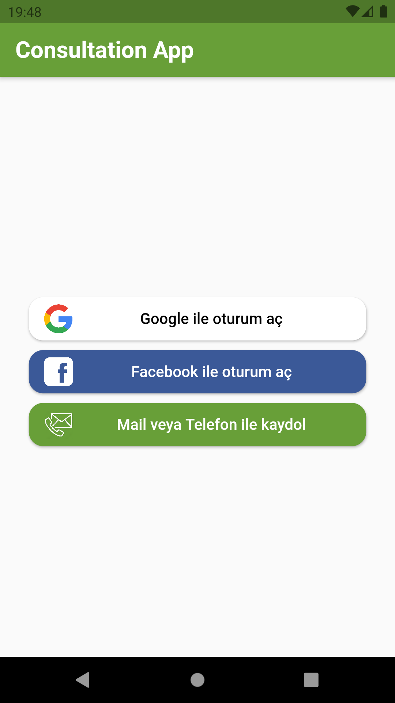
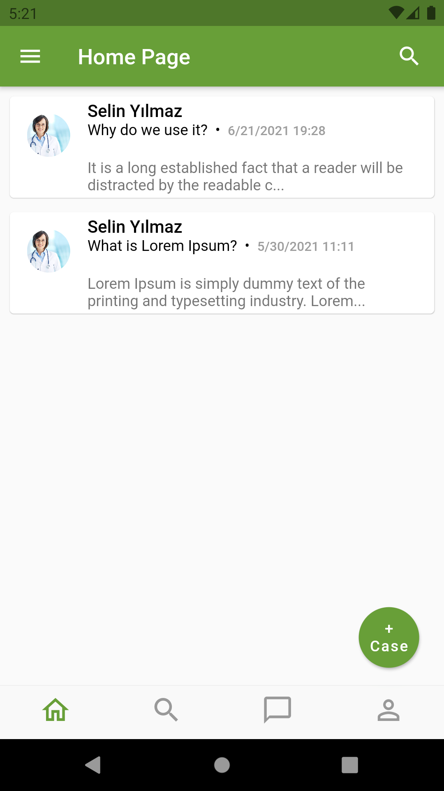
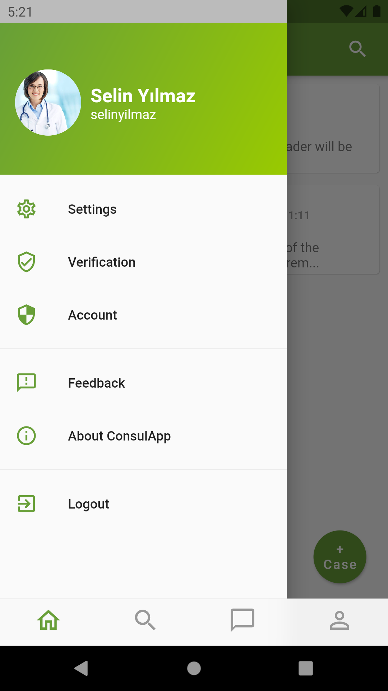
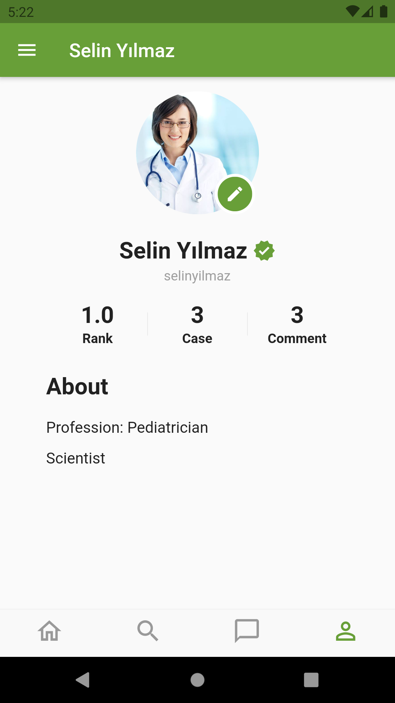
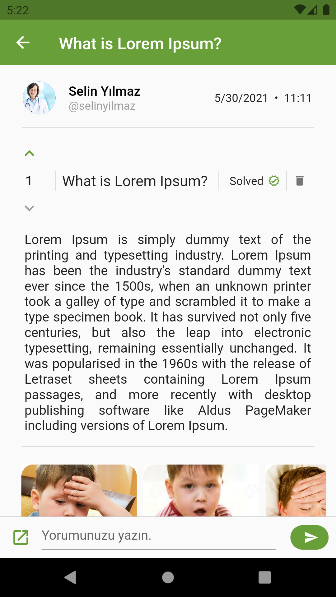
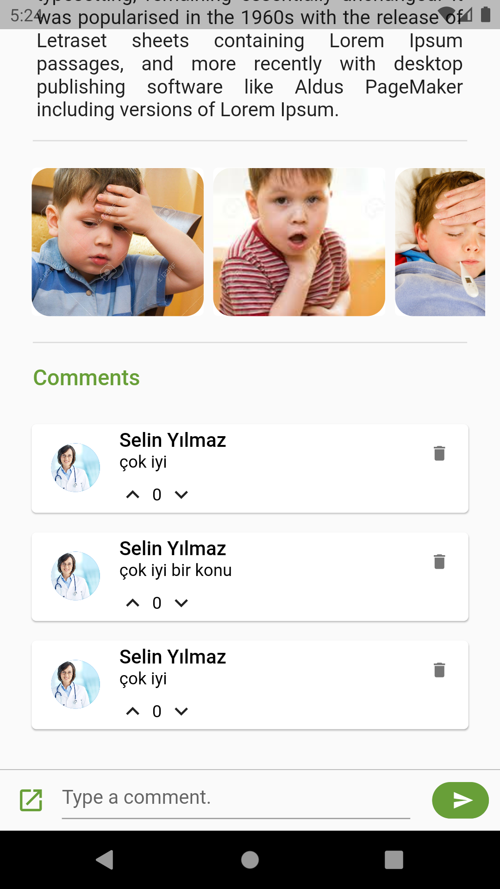
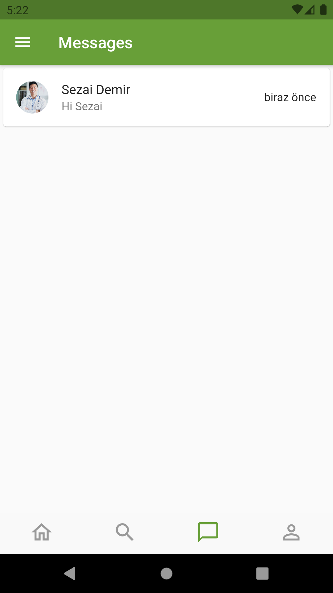
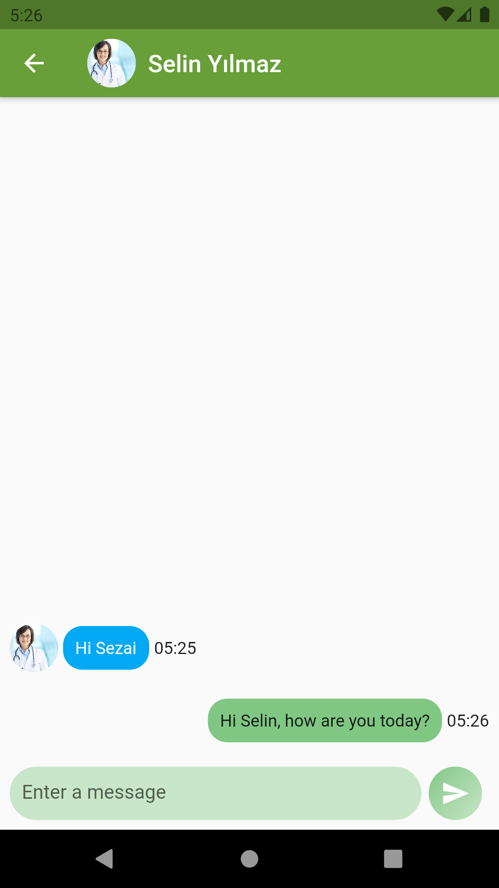

# Consultation App

Consultation App is a Firebase-based, cross-platform, real-time application that can be used in many languages thanks to localization, and where physicians can collaborate on cases and share ideas. In addition, students in the medical field can benefit from this application and acquire various experiences during their studies.

This project was prepared as a software engineering thesis.

## Screenshots

   
   
 
